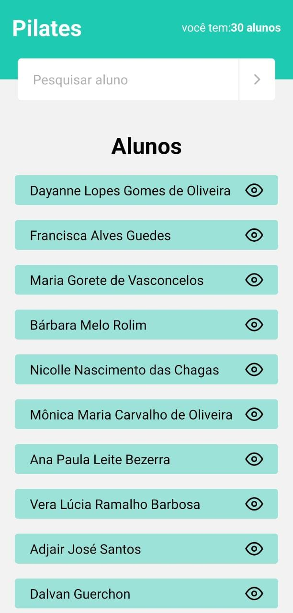

<h1 align='center'>Pilates-App</h1>


<p>Aplicativo para monitoramento de alunos, da turma de pilates, da professora cintia freitas, aonde esta consumido a api que fornece os dados que vem do app desktop  </p>

<div align="center">
<Br> <Br>
</div>


## 🛠 Tecnologias | Dependências

<p>Principais ferramentas que foram usadas na construção do projeto</p>

<h3>Tecnologias</h3>

✅ Expo <br>
✅ Axios <br>
✅ React-Native <br>
✅ Typescript <br>
✅ styled-components <br>
✅ react-navigation <br>


## <h4 align="center"> 
    🚀 Projeto em desenvolvimento
## pré-requisito

Antes de começar, você vai precisar ter instalado em sua máquina as seguintes ferramentas: 

[Git](https://git-scm.com), [Node.js](https://nodejs.org/en/), [Expo Go](Playstore)

Além disso é bom ter um editor para executar o código como [VsCode](https://code.visualstudio.com/download)

### 🎲 Rodando o projeto

```bash

#clone este repositório

$ git clone https://github.com/LeandroSannt/pilates-app.git

## acesse a pasta do projeto no terminal/cmd

$ cd pilates-app

## instale as dependencias 

$ yarn install

## execute a aplicação em modo de desenvolvimento 

$ expo start

# O servidor iniciará na porta:3000, acesse <http://localhost:3000>

```
